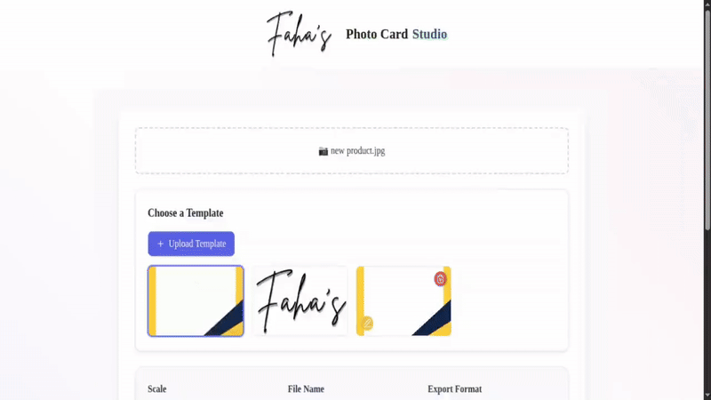

# 📸 Photo Card Generator

Create customizable photo cards with templates, filters, and adjustable image settings, perfect for social media posts, brand promotions, and eCommerce marketing.

## 🚀 Live Demo

Check out the live demo: [Photo Card Generator](https://photo-card-beta.vercel.app/)

## 🎥 Demo Preview

Photo Card Generator

Transform your product photos into stunning social media content with this powerful Next.js-based Photo Card Generator. Built for eCommerce businesses and digital marketers, this modern web application streamlines the creation of professional photo cards with customizable templates, advanced filters, and flexible export options. Whether you're managing an online store, running social media campaigns, or handling brand assets, this tool helps you create consistent, eye-catching visuals in seconds. Featuring real-time previews, smart image validation, and responsive design, it's the perfect solution for modern digital content creation.

> Create professional social media photo cards for your eCommerce products in seconds

[](https://nextjs.org/)
[](https://www.typescriptlang.org/)
[](https://tailwindcss.com/)
[](https://opensource.org/licenses/MIT)

## ✨ Features

- 🖼️ Custom template selection and management (PNG format)
- 📤 Smart file upload with validation:
  - Photos: JPG, JPEG, PNG formats
  - Templates: PNG format only
  - 10MB size limit with validation feedback
- 🎨 Image adjustment controls:
  - Scale/resize
  - Brightness
  - Contrast
  - Grayscale
  - Sepia effects
- 📏 Guide overlay for precise positioning
- 💾 Multiple export formats (PNG/JPEG)
- 📝 Custom filename support
- 🔄 Reset and adjustment capabilities
- 📱 Responsive design with Tailwind CSS
- 🔍 Real-time preview updates

## Project Structure

```
├── public/
│   ├── templates/        # Card template images
│   │   ├── logo.png
│   │   └── template.png
│   └── video/           # Demo assets
│       └── demo.gif     # Application demo
├── src/
│   ├── app/             # Next.js app directory
│   │   ├── Footer.tsx   # Footer component
│   │   ├── globals.css  # Global styles
│   │   ├── layout.tsx   # Root layout
│   │   └── page.tsx     # Home page
│   ├── components/      # React components
│   │   ├── CardPreview.tsx    # Preview component
│   │   ├── Controls.tsx       # Image controls
│   │   ├── TemplateManager.tsx # Template management
│   │   └── UploadArea.tsx     # File upload area
│   ├── types/          # TypeScript definitions
│   │   ├── css.d.ts    # CSS type definitions
│   │   └── index.ts    # Common type definitions
│   └── utils/
│       └── generateCard.ts    # Card generation logic
├── next-env.d.ts       # Next.js TypeScript definitions
├── next.config.mjs     # Next.js configuration
├── package.json        # Project dependencies
├── postcss.config.js   # PostCSS configuration
├── tailwind.config.js  # Tailwind CSS configuration
└── tsconfig.json      # TypeScript configuration
```

## Getting Started

1. **Clone the repository:**

   ```bash
   git clone https://github.com/faha1999/photo-card.git
   cd photo-card
   ```

2. **Install dependencies:**

   ```bash
   npm install
   ```

3. **Run the development server:**

   ```bash
   npm run dev
   ```

4. Open [http://localhost:3000](http://localhost:3000) with your browser to see the application.

## 🛠️ Tech Stack

- **Framework:** [Next.js](https://nextjs.org/) 15.4
- **Language:** [TypeScript](https://www.typescriptlang.org/) 5.9
- **UI Library:** [React](https://reactjs.org/) 19.1
- **Styling:** [TailwindCSS](https://tailwindcss.com/) 3.3
- **Icons:** [Lucide React](https://lucide.dev/)
- **Image Manipulation:** HTML5 Canvas API
- **Development Tools:**
  - PostCSS
  - Autoprefixer
  - ESLint
  - TypeScript Compiler

## Available Scripts

- `npm run dev` - Starts the development server
- `npm run build` - Builds the app for production
- `npm start` - Runs the built app in production mode
- `npm run lint` - Runs linting checks

## 🧩 Components

### App Components (`src/app/`)

#### Footer.tsx

- Renders the application footer
- Contains project attribution and links
- Responsive design with Tailwind CSS

#### Layout.tsx

- Main application layout wrapper
- Handles metadata and SEO settings
- Manages global styles and fonts

#### Page.tsx

- Main application page component
- Orchestrates component composition
- Manages global state and data flow

### Feature Components (`src/components/`)

#### CardPreview.tsx

- Renders real-time photo card preview
- Implements HTML5 Canvas for image manipulation
- Handles filters and effects (brightness, contrast, etc.)
- Manages guide overlay for positioning
- Provides real-time visual feedback
- Supports touch interactions for mobile users

#### Controls.tsx

- Image adjustment interface
- Scale/resize controls with predefined options
- Advanced filter controls:
  - Brightness and contrast sliders
  - Grayscale and sepia effects
  - Blend mode selection
- Export format selection (PNG/JPEG)
- Custom filename input
- Guide overlay toggle
- Reset functionality

#### TemplateManager.tsx

- Template selection and management interface
- Supports default and custom templates
- PNG template upload functionality
- Template preview with live updates
- Template deletion and renaming features
- Local storage integration for user templates
- Drag-and-drop template switching

#### UploadArea.tsx

- Smart file upload component
- Drag-and-drop functionality
- File type validation:
  - Photos: JPG, JPEG, PNG support
  - Templates: PNG only restriction
- 10MB file size limit enforcement
- Real-time validation feedback
- User-friendly error messages
- Progress and status indicators

## � Types (`src/types/`)

### css.d.ts

- TypeScript definitions for CSS modules
- Style-related type declarations
- Custom CSS property definitions

### index.ts

- Core type definitions
- Interface declarations for:
  - Filter settings
  - Position coordinates
  - Card state management
  - Component props
  - Image generation options

## 🛠️ Utils (`src/utils/`)

### generateCard.ts

- Core image processing functionality
- Advanced features:
  - Image scaling and positioning
  - Filter and effect application
  - Template overlay handling
  - Guide rendering system
  - Multiple export format support
  - Base64 conversion
  - Error handling
  - Performance optimizations

## ⚙️ Configuration Files

### next.config.mjs

- Next.js framework configuration
- Image optimization settings
- Build and deployment options

### tailwind.config.js

- Tailwind CSS customization
- Theme and color palette settings
- Responsive breakpoints
- Custom plugin configuration

### tsconfig.json

- TypeScript compiler options
- Path aliases and module resolution
- Strict type checking settings
- Build optimization rules

## 🤝 Contributing

Contributions are welcome! Here's how you can help:

1. Fork the repository
2. Create your feature branch:
   ```bash
   git checkout -b feature/AmazingFeature
   ```
3. Commit your changes:
   ```bash
   git commit -m 'Add some AmazingFeature'
   ```
4. Push to the branch:
   ```bash
   git push origin feature/AmazingFeature
   ```
5. Open a Pull Request

Please ensure your PR adheres to the following:

- Follows the existing code style
- Includes appropriate tests if applicable
- Updates documentation as needed
- Maintains TypeScript type safety

## 📄 License

This project is licensed under the MIT License - see the [LICENSE](LICENSE) file for details.

## 👤 Contact

Kawsar Ahmed Fahad

- GitHub: [@faha1999](https://github.com/faha1999)

## 🌟 Show your support

Give a ⭐️ if this project helped you!
